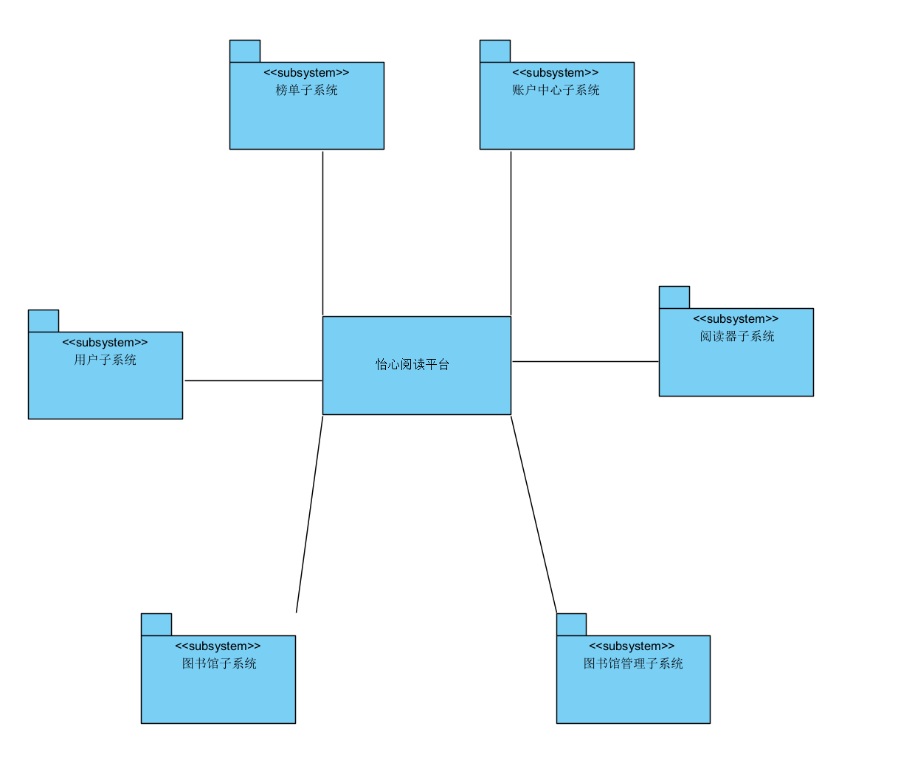
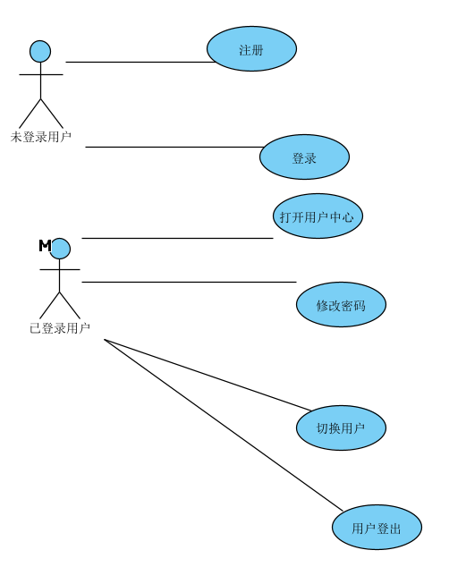
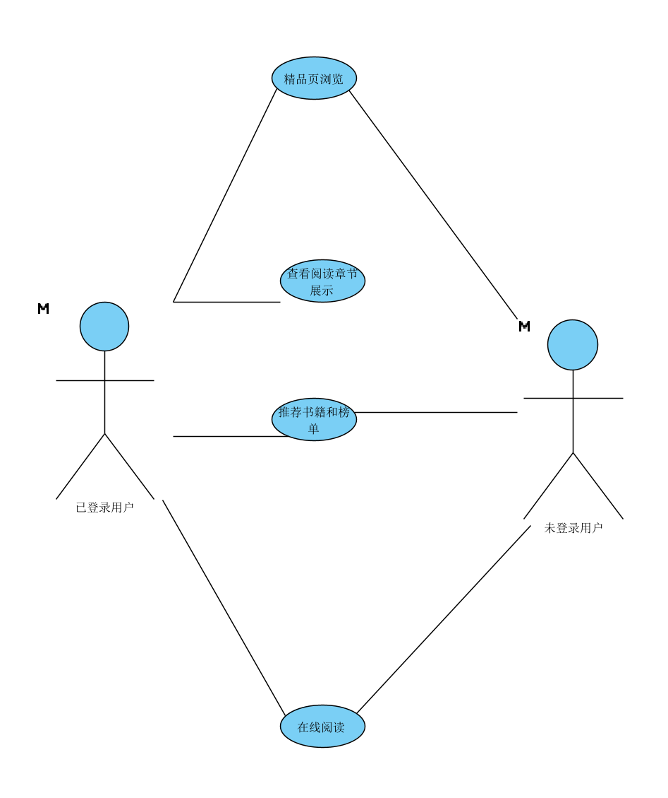
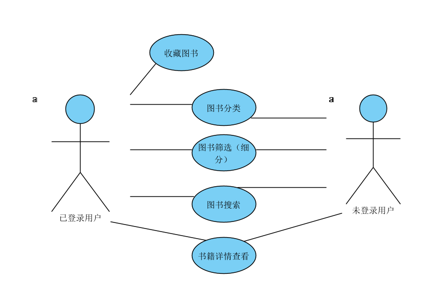
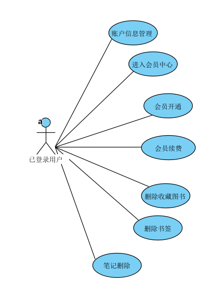
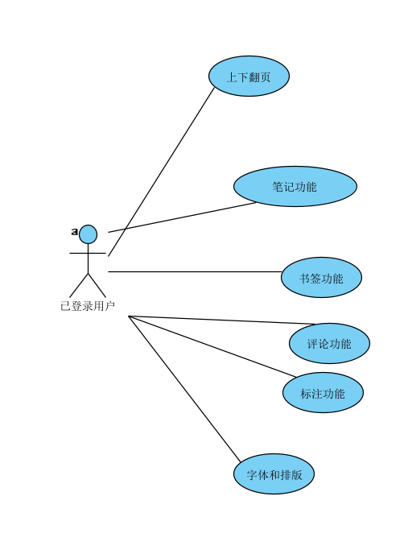
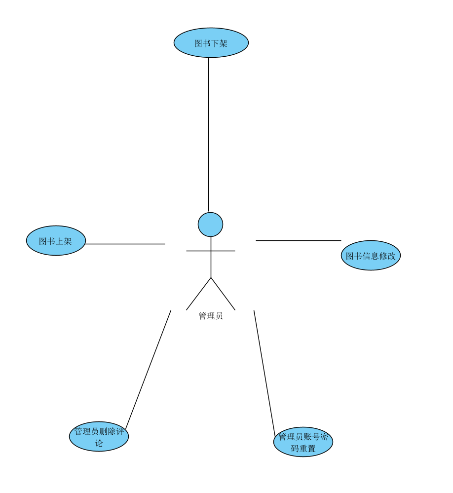
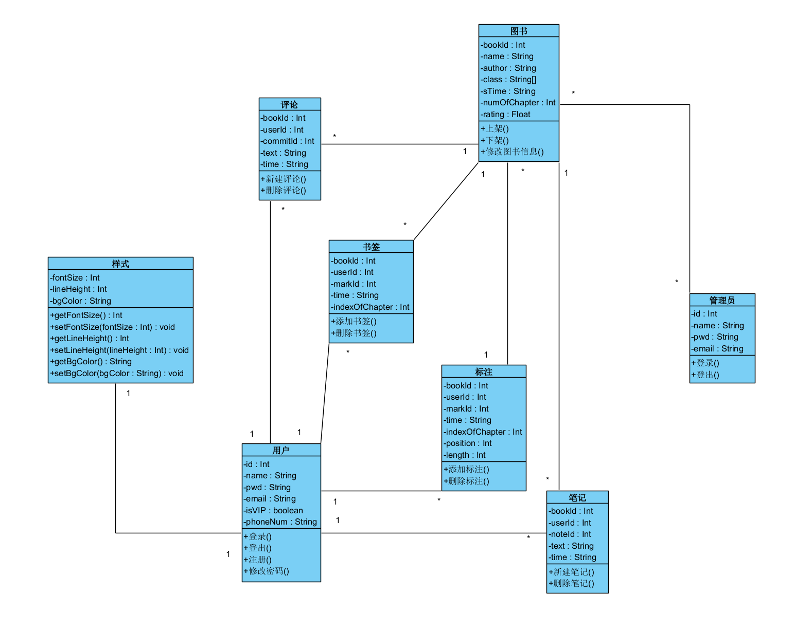

# 软件需求规格说明书

[TOC]

## 1.引言

### 1.1编写目的

本文的编写目的是为了规定“怡心阅读”在线阅读平台的功能要求、实现方式、交互流程、技术标准等关键要素和细节，协助开发团队和利益相关方(如客户、用户、测试团队等)理解和达成共识，从而为项目的开发和实施提供指导和支持。该文档反映了项目的总体需求、技术方案、操作流程、数据模型、界面设计、安全性、质量保证等方面的详细说明和指导，并提供了相关标准和规范的参考。在文档中，我们扼要描述了平台的整体概述以及主要功能模块，分别包括：基础功能、精品（榜单）页、图书馆、账户中心、阅读器和图书管理。 针对这些功能模块，我们进一步说明了需求细节和实现方案，包括用户登录、注册、个人信息管理、精品页的显示、图书馆的分类、搜索、推荐等，以及阅读器的界面设计、核心功能、数据处理等方面。我们还明确了开发项目时应该遵循的原则，如主动借鉴互联网平台，尽可能地满足甲方的设想，同时确保平台功能的易用性、安全性和可维护性，不干涉用户前端操作等。本文旨在作为开发人员的参考，帮助他们快速准确地理解业务需求和技术方案，开发出高质量、满足需求的平台，最大化满足客户和用户的期望和要求。

### 1.2项目背景

“怡心阅读”是一款致力于打造优质阅读体验的在线阅读平台，旨在为广大读者提供便捷的阅读、收藏、笔记等功能，满足其阅读和学习的需求，丰富其精神生活。由于现代人的生活方式发生了巨大变化，越来越多的人开始接触网络阅读，这种方式不仅提供了更多的阅读材料和便利的阅读体验，而且还可以让人们随时随地进行阅读，进一步满足了人们对知识和文化的追求。

为了丰富北航师生的精神生活，本公司决定开发一个“怡心阅读”在线阅读平台。这个阅读网站旨在为用户提供一个方便的阅读体验，包括浏览和管理用户的书籍、添加书签、笔记和高亮等功能。

### 1.3组员分工

| 聂睿       | 检查各部门项目进度，撰写相关报告文档，后端代码设计与编写，后端请求处理代码编写 |
| ---------- | ------------------------------------------------------------ |
| **韩一**   | **检查各部门项目进度，撰写相关报告文档，后端代码设计与编写，后端请求处理代码编写** |
| **李一博** | **设计网站界面，前端代码设计与编写，前端请求代码编写，撰写需求规格说明书** |
| **陈宇鑫** | **设计网站界面，前端代码设计与编写，前端请求代码编写，撰写需求规格说明书** |
| **吴一凡** | **设计网站界面，前端代码设计与编写，前端请求代码编写，撰写需求规格说明书** |

### 1.3参考资料

[1]	吕云翔，王昕鹏，邱玉龙. 软件工程——理论与实践. 北京：人民邮电出版社，2012.

[2]	吕云翔，刘浩，王昕鹏，周建. 软件工程课程设计. 北京：机械工业出版社，2009.

## 2.任务概述

### 2.1目标

1. 提供一个贴近读者需求的在线阅读平台，使用户能够更加方便、快速地获取所需的阅读材料，并享受优质的阅读体验。
2. 打造一个综合性的阅读平台，将图书馆、精品推荐、个性化推荐等内容融合在一起，增加阅读的多样性和趣味性。
3. 引入先进的技术，如大数据算法、机器学习、人工智能等，为用户提供更加准确、智能的推荐服务。
4. 保证平台的功能易用性、安全性、稳定性和可维护性，确保平台的功能稳定运行和安全使用。
5. 满足用户的个性化需求，促进用户参与和互动，建立良好的用户口碑和品牌影响。
6. 提高客户满意度和用户体验，为客户创造价值

### 2.2用户特点

目标用户是有阅读需求的人群，包括广大普通读者、学生、教师、文艺爱好者等。用户年龄覆盖范围较广，从年轻人到老年人都有可能成为平台的用户。主要用户特点包括：

1. 注重阅读质量。这些用户对阅读材料的质量要求较高，喜欢能提供有深度、有价值的图书、文章或论文，且希望能在平台上找到能够满足自己需求的内容。
2. 追求阅读体验。用户们渴望在阅读过程中获得优质的体验，希望平台能够提供优美的阅读界面和强大的阅读功能，如自动翻页、标注、笔记等。
3. 注重个性化服务。用户们希望平台能够提供个性化的服务，根据其阅读历史和兴趣偏好推荐符合其需求的图书和文章。
4. 对平台安全性有一定要求。用户们关注平台的安全性和隐私性，希望平台能够保证其个人信息和阅读记录等数据的安全性。
5. 有较高的文艺需求。文艺爱好者和学术研究者对文学、艺术、历史等方面的阅读需求比较大，他们希望平台能够提供更多优质的文艺类书籍和资料。

### 2.3术语定义

暂无

## 3.非技术要求

1. 丰富性的内容资源：平台应该拥有高质量、丰富类别的网络小说，并提供方便用户进行浏览、搜索和筛选的功能。
2. 高效性的页面加载速度：针对各类用户进行适应性的优先加载，应该保证页面的加载速度快，以提供更好的用户体验。
3. 个性化的推荐服务：根据用户的历史阅读数据、兴趣偏好推荐小说，以提供更好的用户体验和忠诚度。
4. 保护用户隐私：平台需要保护用户隐私，包括用户的个人信息、阅读记录等，以确保用户信息不会泄漏或被滥用。
5. 演示页面内容的准确性：平台提供的网络小说内容需求准确无误，且应准确反映原著情节和风格，不允许涉及侵犯版权或违反社会正常价值观念有关的主题。
6. 稳定的运行：提供网络小说的平台应该稳定运行，随时可用，同时需要具备扩展性，以便在用户规模增长时，满足更大的并发量需求。
7. 可靠的数据备份与恢复：平台需要定期备份数据，避免未来数据丢失的风险，并且在意外故障时能够快速恢复线上数据服务。

## 4.系统环境

### 4.1硬件运行环境

1. 服务器
2. Web浏览PC机

### 4.2软件运行环境

1. 服务器
2. 客户机

### 4.3开发环境

**硬件环境**

- 处理器型号：Intel® Core™ i5-9500U CPU @2.70Ghz 2.90Ghz
- 内存空间：8GB
- 硬盘容量：500GB
- 输入输出设备：鼠标、键盘、显示屏
- 网络配置：100M带宽网络适配器。

**软件环境**

- 操作系统：Windows 10 64-bits
- 数据库：DataGrip 连接 MySQL
- 开发语言：Python、CSS、Razor(HTML)等
- 开发框架：Vue 3
- 软件运行环境：
- 集成开发环境：Visual Studio Code 2021
- WEB 服务器：
- 测试工具：Visual Studio
- 版本控制工具：Git

（注：本小组可能依据实施过程中的实际需要对于软件和硬件环境做出相应的调整）

## 5.功能需求

### 5.1结构化自然语言需求

#### 5.1.1用户故事

1. 作为用户，我希望可以注册账号并登录，以便于使用个人化的阅读服务。

   描述：用户需要注册账号以获得访问图书、管理个人藏书和个性化推荐等服务。

2. 作为用户，我希望可以浏览精品、排行、分类和搜索图书，并在个人账户中管理自己的藏书。

   描述：用户需要能够快速浏览各类图书，按照不同属性进行筛选及搜索，在个人账户中收集自己喜欢的图书及笔记等。

3. 作为用户，我希望可以在阅读器中进行基本的阅读操作，包括上下翻页、字体调整等，并在阅读时添加书签、笔记和高亮。

   描述：用户需要在阅读器中自由地进行阅读操作，同时便于增加、修改个人笔记。

4. 作为管理员，我希望可以在管理员端上架、下架、修改书籍。

   描述：管理员需要对书籍进行管理，包括上架、下架及修改操作等。

#### 5.1.2交互流程（成功与可选流程）

成功流程：

1. 用户成功登录/注册
   - 用户输入用户名和密码进行登录/输入个人信息进行注册。
   - 系统验证用户信息，如果正确，允许用户登录并进入个人账户中心。
   - 用户进入个人账户中心，可以进行管理自己的账户信息、图书订单、个人笔记和会员管理等操作。
2. 用户成功查找和选择图书
   - 用户进入图书馆页面，可以快速查找和浏览不同种类的图书。
   - 用户按照书名、作者和分类、排行等属性进行筛选和搜索。
   - 用户可以点击图书，查看详细信息，包括封面、作者、出版社、ISBN、出版时间等，并可以将其添加到个人藏书中。
3. 用户成功使用阅读器
   - 用户在个人账户中心或个人藏书中选择图书，进入阅读器页面。
   - 用户可以在阅读器中进行基本的阅读操作，包括上下翻页、字体调整、背景切换等。
   - 用户可以在阅读时添加笔记和高亮，并在之后再次查看和编辑。
4. 管理员成功管理图书
   - 管理员进入管理员界面，可以管理图书的上架、下架、修改等操作。
   - 管理员可以新增或删除图书信息，或对图书详细信息进行修改。
   - 管理员成功操作后，系统会进行验证并提示操作成功或失败的信息。

可选流程：

1. 用户忘记密码，需要找回密码
   - 用户进入登录页面，选择找回密码。
   - 用户输入注册时的邮箱，系统向用户指定的邮箱发送找回密码的请求。
   - 用户按照邮件提示操作，重置自己的账户密码。
2. 用户订购会员，进行支付
   - 用户在个人账户中心中选择订阅会员等信息。
   - 用户选择支付方式，进行支付操作。
   - 支付完成后会员状态自动更新，用户能够享有会员服务。
3. 用户提交书评
   - 用户阅读完某一本书籍后，可以提交书评。
   - 用户在书评页面填写自己的评价和建议，给出相应的打分。
   - 系统验证书评信息，并保存用户提交的内容。
4. 用户向管理员提交反馈
   - 用户在界面底部看到反馈按钮，点击进入反馈页面。
   - 用户在页面中填写相关信息和反馈内容。
   - 管理员收到反馈信息，并在后台进行快速处理与回复。
5. 用户在阅读时出现页面加载失败的操作
   - 用户在阅读器页面阅读图书，但是出现了页面加载失败。
   - 系统重新请求加载相应的页面，在加载成功后，恢复用户之前的阅读状态。
6. 用户对阅读器位置进行保存或标记
   - 用户在阅读过程中，可以对当前的阅读位置进行保存或标记。
   - 用户可以把阅读器窗口关闭，并重新打开后，系统会自动恢复之前的阅读位置。
7. 用户修改个人信息
   - 用户在个人账户中心中，可以修改和管理个人信息。
   - 用户选择修改个人信息后，输入需要修改的信息内容。
   - 系统验证用户信息并保存修改成功提示信息。

### 5.2模型化需求

#### 5.2.1子系统划分

#### 5.2.2用例图和用例描述

##### 5.2.2.1用户子系统

具体用例解释如下1.1~1.6表

| 编号     | 1.1                                                          |
| -------- | ------------------------------------------------------------ |
| 用例名称 | 用户注册                                                     |
| 使用人员 | 未登录用户                                                   |
| 输入     | 用户名、密码、联系方式                                       |
| 系统响应 | 注册成功                                                     |
| 前置条件 | 无                                                           |
| 后置条件 | 创建新用户账户                                               |
| 交互行为 | 1.用户选择“注册”按钮 2.系统跳转至“注册”页面 3.用户填写注册信息，包括用户名、密码、邮箱地址等 4.用户点击“注册”按钮 5.系统对用户填写的信息进行验证，确保信息符合要求 6.验证成功后，系统创建新用户账户，保存用户信息 7.系统发送验证信息到用户注册时填写的邮箱地址 8.用户去邮箱内点击收到的链接进行邮箱验证 9.邮箱验证通过后，系统提示用户注册成功 10.系统自动跳转至登录页面，方便用户直接登录新账户。 |
| 异常处理 | 注册信息不完整或格式不正确时，系统提示错误消息。             |
| 特别说明 | 用户名、密码、联系方式是必填项，密码需要满足一定复杂度要求。 |

| 编号     | 1.2                                                          |
| -------- | ------------------------------------------------------------ |
| 用例名称 | 用户登录                                                     |
| 使用人员 | 未登录用户                                                   |
| 输入     | 用户名、密码                                                 |
| 系统响应 | 登录成功                                                     |
| 前置条件 | 无                                                           |
| 后置条件 | 登录到系统                                                   |
| 交互行为 | 1.用户打开登录页面 2.用户输入用户名和密码 3.用户点击“登录”按钮 4.系统在后台进行验证，检查用户名和密码是否匹配已有用户信息 5.如果验证成功，系统将跳转到系统首页 6.如果验证失败，则系统会提示用户错误信息，告知其登录失败 7.用户可以返回登录页面，重新输入用户名和密码 8.如果用户无法记得自己的用户名或密码，系统可提供找回密码或用户名的选项 9.用户可以选择通过邮箱或安全问题来找回其账户信息 10.如果找回信息成功，系统会提示用户重置密码或获取新的用户名 11.用户可以使用新的信息在登录页登录，从而重新访问系统。 |
| 异常处理 | 用户名或密码错误时，系统提示错误消息。                       |
| 特别说明 | 无                                                           |

| 编号     | 1.3                                                  |
| -------- | ---------------------------------------------------- |
| 用例名称 | 打开用户中心                                         |
| 使用人员 | 已登录用户                                           |
| 输入     | 无                                                   |
| 系统响应 | 进行子系统切换，切换账户中心子系统                   |
| 前置条件 | 用户已登录                                           |
| 后置条件 | 切换至用户中心子系统                                 |
| 交互行为 | 1.用户点击个人信息页面 2.系统跳转至个人信息页面 |
| 异常处理 | 无                                                   |
| 特别说明 | 无                                                   |

| 编号     | 1.4                                                          |
| -------- | ------------------------------------------------------------ |
| 用例名称 | 修改密码                                                     |
| 使用人员 | 已登录用户                                                   |
| 输入     | 原密码、新密码                                               |
| 系统响应 | 密码修改成功                                                 |
| 前置条件 | 用户已登录                                                   |
| 后置条件 | 无                                                           |
| 交互行为 | 1.用户登录系统，进入个人信息页面 2.用户选择修改密码选项 3.系统要求用户输入当前密码、新密码和确认密码 4.用户依次输入当前密码、新密码和确认密码 5.系统进行验证，验证当前密码是否正确 6.如果验证成功，系统进一步验证新密码是否符合规范，例如长度是否够、是否包含字母和数字等 7.如果验证新密码也符合要求，则系统将新密码更新到用户账号信息中 8.系统提示用户密码修改成功信息 9.如果验证失败，则系统会告知用户失败原因，并要求用户重新填写相应信息 10.用户可以随时查看和修改自己的密码，以保护账户安全 11.如果用户想要返回到个人信息页面，可以点击返回按钮，返回到个人信息页面。 |
| 异常处理 | 如果输入的原密码不正确，系统会提示错误信息并要求重新输入；如果新密码不符合规定的密码格式，系统会提示错误信息并要求重新输入。 |
| 特别说明 | 修改密码操作是保证用户账号信息安全性的基础，用户应该定期更新自己的密码，并选择安全性较高的密码。 |

| 编号     | 1.5                                                          |
| -------- | ------------------------------------------------------------ |
| 用例名称 | 切换用户                                                     |
| 使用人员 | 已登录用户                                                   |
| 输入     | 用户的登录信息                                               |
| 系统响应 | 成功切换用户                                                 |
| 前置条件 | 用户已通过上一个账号登录                                     |
| 后置条件 | 无                                                           |
| 交互行为 | 1.用户已登录系统，进入个人信息页面 2.用户选择切换用户选项 3.系统跳转至登录页面，要求用户输入新的登录信息，包括新的用户名和密码 4.用户输入新的登录信息 5.系统进行验证，检查新的用户名和密码是否正确 6.如果验证成功，系统自动注销当前用户，同时登录新用户 7.系统跳转至系统首页，并以新用户身份登录 8.如果验证失败，则系统会提示用户错误信息，并返回登录页面，要求用户重新输入登录信息 9.用户可以随时切换其本人以外的其他用户，以便实现多用户共享系统资源的目的 |
| 异常处理 | 如果输入的新登录信息不合法，系统会提示错误信息并要求重新输入；如果新用户已经登录，系统会提示是否注销已登录的用户。 |
| 特别说明 | 用户可以通过切换用户的方式方便地实现多个账号之间的快速切换，以满足不同需求。 |

| 编号     | 1.6                                                          |
| -------- | ------------------------------------------------------------ |
| 用例名称 | 用户登出                                                     |
| 使用人员 | 读者或管理员                                                 |
| 输入     | 无                                                           |
| 系统响应 | 用户已成功登出                                               |
| 前置条件 | 用户已登录                                                   |
| 后置条件 | 用户已退出登录                                               |
| 交互行为 | 1.用户已经登录系统 2.当用户希望注销时，点击页面上的“登出”按钮 3.系统接收登出请求后，清除当前用户在其会话期间所设置的任何会话状态和登录信息 4.系统将当前页面重定向到登录页面 5.用户需要再次输入其用户名和密码来重新登录系统 6.在用户进行登录前，系统会记住用户的访问状态和所访问的页面，以便用户在重新登录到系统后，可以直接跳转到他们原本所访问的页面，而无需从登录页面开始 7.如果用户长时间未进行任何操作，系统会自动将用户注销，以保障系统安全 8.系统注销用户时，用户状态和登录信息将被清除，并且系统将会移除任何会话数据，并退出用户对系统的访问。 |
| 异常处理 | 如果用户在当前会话期间没有登录，则系统会提示“您需要登录才能执行该操作”的错误信息，用户需要登录后才能执行登出操作。 |
| 特别说明 | 退出登录功能是保证系统安全性和用户信息安全性的重要措施之一，用户可以在不需要访问系统时通过退出登录来保护自己的信息。 |

##### 5.2.2.2榜单子系统

具体用例解释如下2.1~2.6表

| 编号     | 2.1                                                          |
| -------- | ------------------------------------------------------------ |
| 用例名称 | 精品页浏览                                                   |
| 使用人员 | 所有用户                                                     |
| 输入     | 无                                                           |
| 系统响应 | 显示精品页                                                   |
| 前置条件 | 用户已登录                                                   |
| 后置条件 | 显示精品页                                                   |
| 交互行为 | 1.用户在首页浏览图书网站。 2.用户看到了“进入精品页”的按钮，点击该按钮。 3.系统跳转到精品页，显示推荐图书、热销图书、新书上架等信息。 4a.用户浏览精品页，查看系统推荐的图书列表。 4b.用户浏览热销图书，查看销量最高的图书列表。 4c.用户浏览新书上架，查看最新上市的图书列表。 5.用户点击图书，跳转到图书详情页。 6.用户可以在图书详情页查看图书的详细介绍、作者、出版社等信息。 |
| 异常处理 | 无                                                           |
| 特别说明 | 无                                                           |

| 编号     | 2.2                                                          |
| -------- | ------------------------------------------------------------ |
| 用例名称 | 收藏图书                                                     |
| 使用人员 | 已登录用户                                                   |
| 输入     | 点击按钮                                                     |
| 系统响应 | 图书收藏添加成功                                             |
| 前置条件 | 用户已登录，并且所添加的图书已经存在于系统中                 |
| 后置条件 | 新的图书已经被加入到精品页中                                 |
| 交互行为 | 1.用户打开添加书籍页面，点击添加图书按钮。 2.用户勾选需要添加的书籍或点击添加按钮。 3.系统在用户个人收藏夹中添加所选图书，并提示图书收藏添加成功。 4.用户可以在个人收藏夹中查看已添加的图书。 5.系统将新的图书加入精品页，用于推荐给其他用户阅读。 |
| 异常处理 | 系统会提示错误信息并要求重新填写。 如果用户尚未登录，则需要先登录系统才能进行收藏。 |
| 特别说明 | 将图书添加至精品页是为了推荐用户阅读更具品质的图书，一般用户可以将自己喜欢的或者认为有品质的图书推荐给其他用户阅读。 |

| 编号     | 2.3                                                          |
| -------- | ------------------------------------------------------------ |
| 用例名称 | 最近阅读章节展示                                             |
| 使用人员 | 已登录用户                                                   |
| 输入     | 无                                                           |
| 系统响应 | 显示最近阅读章节                                             |
| 前置条件 | 已登录用户                                                   |
| 后置条件 | 显示最近阅读章节                                             |
| 交互行为 | 1.系统根据用户已保存的阅读记录，展示上次阅读的书籍封面和章节信息。 2.用户可以选择进入上次阅读的章节，或者返回书籍列表查看其他书籍。 3.用户点击进入上次阅读的章节，系统跳转到该章节的阅读页。 4.用户可以在阅读页中阅读该章节的内容。 |
| 异常处理 | 无                                                           |
| 特别说明 | 最近阅读的章节信息都需要保存在数据库中。                     |

| 编号     | 2.4                                                          |
| -------- | ------------------------------------------------------------ |
| 用例名称 | 推荐书籍和榜单                                               |
| 使用人员 | 所有用户                                                     |
| 输入     | 无                                                           |
| 系统响应 | 显示推荐的书籍和榜单                                         |
| 前置条件 | 已登录用户                                                   |
| 后置条件 | 显示推荐的书籍和榜单                                         |
| 交互行为 | 1.用户在主界面中找到并点击“推荐”页面。 2.系统根据用户的个人偏好、历史阅读记录等信息，推荐相关的图书和榜单给用户。 3.用户可以看到系统推荐的图书列表，图书列表中包含图书封面、书名、作者、评分等信息。 4.当用户点击某个榜单时，系统将自动显示该榜单中的图书列表。 5.用户可以通过点击图书列表中某个图书，跳转到该图书的详情页，查看图书的详细信息 |
| 异常处理 | 无                                                           |
| 特别说明 | 推荐算法需要根据用户的行为和喜好进行实时计算。               |

| 编号     | 2.5                                                          |
| -------- | ------------------------------------------------------------ |
| 用例名称 | 书籍详情查看                                                 |
| 使用人员 | 所有用户                                                     |
| 输入     | 书籍名称或ISBN编号或直接点击                                 |
| 系统响应 | 显示书籍详细信息                                             |
| 前置条件 | 无                                                           |
| 后置条件 | 显示书籍详细信息                                             |
| 交互行为 | 1.用户打开图书信息查看功能。 2.系统将查询到的书籍信息显示给用户，包括书名、作者、出版社、出版年份、页数、定价、ISBN编号等详细信息。 3.用户可以进行查看、收藏、评价等操作。 3a.如果用户选择了查看功能，系统将展示书籍内容的摘要或部分章节供用户参考。 3b.如果用户选择了收藏功能，系统将在用户个人收藏夹中保存该书籍信息。 3c.如果用户选择了评价功能，系统将为用户提供评价表单，用户可以填写自己对该书籍的评价。 |
| 异常处理 | 书籍不存在时，系统提示错误消息。 如果用户尚未登录，则需要先登录系统才能进行借阅、评论等操作。 |
| 特别说明 | 书籍详细信息包括但不限于：书名、作者、出版社、价格、简介、评价等。 |

| 编号     | 2.6                                                          |
| -------- | ------------------------------------------------------------ |
| 用例名称 | 在线阅读                                                     |
| 使用人员 | 所有用户                                                     |
| 输入     | 书籍名称或ISBN编号，阅读章节或直接点击                       |
| 系统响应 | 显示阅读界面                                                 |
| 前置条件 | 已登录用户，并已购买所需书籍                                 |
| 后置条件 | 显示书籍阅读界面                                             |
| 交互行为 | 1.用户在图书详情页面中点击“开始阅读”按钮。 2.系统根据用户保存的阅读记录，自动跳转到上次阅读的章节，或者跳转到该书的目录页面。 3.用户可以通过目录页面，选择任意章节进行阅读。 4.用户可以在阅读页面中进行上下翻页的操作，或者直接在进度条上滑动选择不同页面。 5.用户可以通过双击屏幕、调整字体大小等操作，优化阅读体验。 6.用户可以通过目录按钮，打开目录以便更好地进行快速跳转。 7.用户可以通过书签功能，在阅读过程中设置书签，以便后续快速返回该页。 8.用户点击“退出阅读”按钮，系统保存当前阅读进度，用户退出阅读页面返回图书详情页。 9.下次用户再次阅读该书籍时，系统会自动跳转到用户上一次停止阅读的章节及页面，以实现连续阅读的体验。 |
| 异常处理 | 书籍不存在、章节不存在时，系统提示错误消息。                 |
| 特别说明 | 在线阅读需要根据用户所购书籍进行实时加载。                   |

##### 5.2.2.3图书馆子系统

具体用例解释如下3.1~1.3表

| 编号     | 3.1                                                          |
| -------- | ------------------------------------------------------------ |
| 用例名称 | 图书分类                                                     |
| 使用人员 | 所有用户                                                     |
| 输入     | 所需图书分类条件                                             |
| 系统响应 | 显示符合条件的图书列表                                       |
| 前置条件 | 无                                                           |
| 后置条件 | 无                                                           |
| 交互行为 | 1.用户选择了图书分类条件，例如“文学”、“科技”等。 2.系统返回与图书分类条件匹配的图书列表。 3.系统在页面上展示匹配的图书列表，包括图书封面、标题、作者、出版社、评分等信息。 4.用户可以滚动页面自由浏览所有返回的图书。 5.用户可以点击某一本书的封面或标题，进入该图书的详细信息页面。 |
| 异常处理 | 根据实际情况进行处理，如筛选条件错误，系统提示错误信息。 如果尚未登录，则需要先登录系统。 |
| 特别说明 | 图书的分类条件可以根据图书元数据进行设计，在系统后台进行管理和更新。 |

| 编号     | 3.2                                                          |
| -------- | ------------------------------------------------------------ |
| 用例名称 | 图书筛选（细分）                                             |
| 使用人员 | 所有用户                                                     |
| 输入     | 所需图书筛选条件                                             |
| 系统响应 | 显示符合条件的图书列表                                       |
| 前置条件 | 无                                                           |
| 后置条件 | 无                                                           |
| 交互行为 | 1.用户在主页选择图书筛选条件 2.用户在系统返回的图书列表中可以查看到符合条件的书籍 3.用户选择其中一本进行阅读或者查看详细信息。 |
| 异常处理 | 根据实际情况进行处理，如筛选条件错误，系统提示错误信息       |
| 特别说明 | 图书筛选条件可以根据图书元数据进行设计，在系统后台进行管理和更新。图书的展示顺序应该尽可能合理，突出热门书籍。 |

| 编号     | 3.3                                                          |
| -------- | ------------------------------------------------------------ |
| 用例名称 | 图书搜索                                                     |
| 使用人员 | 所有用户                                                     |
| 输入     | 搜索关键词、图书详细信息                                     |
| 系统响应 | 显示符合条件的图书列表及图书大致信息                         |
| 前置条件 | 无                                                           |
| 后置条件 | 无                                                           |
| 交互行为 | 1.用户进入图书网站的主页，在页面上找到搜索框，并输入想要搜索的图书名称、作者或者关键词。 2.用户点击搜索按钮或按下回车键，系统根据用户输入的关键词返回符合条件的图书列表。 3.系统在页面上展示匹配的图书列表，包括图书封面、标题、作者、出版社、评分等信息。 4.用户可以滚动页面自由浏览所有返回的图书。 5.用户可以点击某一本书的封面或标题，进入该图书的详细信息页面。 6.在图书的详细信息页面上，用户可以浏览图书的详细信息、评论等。 7.系统展示该书籍的详细信息，包括图书简介、分类、评价、评分等。 8.用户可以点击某一本书的封面或标题，进入该图书的详细信息页面。 |
| 异常处理 | 根据实际情况进行处理，如搜索结果为空，系统提示错误信息。 如果用户尚未登录，则需要先登录系统才能进行借阅、评论等操作。 |
| 特别说明 | 图书搜索和浏览详情是图书馆子系统的核心功能之一，该功能对于提升用户体验和图书馆的服务质量具有重要意义。 |

##### 5.2.2.4账户中心子系统

具体用例解释如下4.1~4.7表

| 编号     | 4.1                                                          |
| -------- | ------------------------------------------------------------ |
| 用例名称 | 账户信息管理                                                 |
| 使用人员 | 已登录用户                                                   |
| 输入     | 用户账户信息                                                 |
| 系统响应 | 账户信息更新成功                                             |
| 前置条件 | 用户已登录                                                   |
| 后置条件 | 账户信息更新到数据库                                         |
| 交互行为 | 1.用户登录系统后，进入账户中心页面，点击进入账户信息管理页面。 2.系统展示用户的当前账户信息，包括用户名、手机号码、邮箱等信息。 3.用户可以针对上述信息进行修改，例如修改密码、手机号码等。 4.用户填写好需要修改的信息，并进行确认操作。 5.系统对用户输入的信息进行合法性检查。如果存在非法信息，系统将提示用户修改，并标注修改错误信息。 6.如无错误信息，系统将更新用户的账户信息，并向用户提示信息更新成功。 7.用户可以查看修改后的账户信息。 |
| 异常处理 | 如输入的信息不合法，系统会提示错误信息并要求用户重新填写。   |
| 特别说明 | 账户信息管理操作是用户进行个人信息管理的入口和基础，通过管理账户信息，用户可以方便地更新自己的信息，提高账户信息的安全性和完整性。 |

| 编号     | 4.2                                                          |
| -------- | ------------------------------------------------------------ |
| 用例名称 | 进入会员中心                                                 |
| 使用人员 | 已登录用户                                                   |
| 输入     | 无                                                           |
| 系统响应 | 进入会员管理中心                                             |
| 前置条件 | 用户已登录                                                   |
| 后置条件 | 进入会员管理中心                                             |
| 交互行为 | 1.用户登录系统 2.用户点击进入会员中心按钮 3.系统检测用户登录状态，确认用户已登录 4.系统响应，进入会员管理中心页面 5.系统展示用户会员信息，包括会员等级、到期时间等信息 |
| 异常处理 | 无                                                           |
| 特别说明 | 无                                                           |

| 编号     | 4.3                                                          |
| -------- | ------------------------------------------------------------ |
| 用例名称 | 会员开通                                                     |
| 使用人员 | 已登录用户                                                   |
| 输入     | 无                                                           |
| 系统响应 | 进入会员开通支付界面                                         |
| 前置条件 | 用户已登录                                                   |
| 后置条件 | 进行会员开通支付                                             |
| 交互行为 | 1.用户进入会员开通支付界面。 2.系统提示用户开通会员的价格和优惠信息。 3.系统弹出支付方式选择界面。 4.用户选择支付方式并输入相应的支付信息。 5.系统进行支付验证，如果支付信息正确，则进行扣款操作。 6.系统提示支付成功，会员开通成功。 7.用户可以查看自己的会员状态，享受相应的优惠。 |
| 异常处理 | 如用户未进行会员开通支付，会取消订单。                       |
| 特别说明 | 无                                                           |

| 编号     | 4.4                                                          |
| -------- | ------------------------------------------------------------ |
| 用例名称 | 会员续费                                                     |
| 使用人员 | 已登录用户                                                   |
| 输入     | 无                                                           |
| 系统响应 | 进入会员续费支付界面                                         |
| 前置条件 | 用户已登录                                                   |
| 后置条件 | 进行会员续费支付                                             |
| 交互行为 | 1.用户登录系统后，点击进入会员中心页面。 2.在页面上，用户可以查看当前的会员状态及有效期。 3.用户点击续费按钮，系统跳转至会员续费支付页面。 4.在支付页面，用户可以选择续费会员的种类和时长，系统会根据所选种类和时长计算出续费的价格。 5.用户确认续费信息，并选择支付方式（如微信、支付宝、银行卡等）进行支付。 6.系统对用户支付的信息进行验证。如果验证通过，系统将向用户提示续费成功的信息，并将会员到期时间延长相应的时长。 7.用户可以在会员中心页面查看新的会员状态和有效期。 |
| 异常处理 | 如用户未进行会员续费支付，会取消订单。                       |
| 特别说明 | 无                                                           |

| 编号     | 4.5                                                          |
| -------- | ------------------------------------------------------------ |
| 用例名称 | 删除收藏图书                                                 |
| 使用人员 | 已登录用户                                                   |
| 输入     | 选定收藏图书                                                 |
| 系统响应 | 收藏图书删除成功                                             |
| 前置条件 | 用户已登录                                                   |
| 后置条件 | 选定收藏图书删除                                             |
| 交互行为 | 1.用户登录系统后，进入图书馆页面，查找自己收藏的图书并进入收藏夹页面。 2.在收藏夹页面，用户可以查看自己已经收藏的图书信息，包括书名、作者、出版社等。 3.用户选中要删除的收藏图书，点击删除按钮。 4.系统提示确认是否删除该图书。 5.用户确认删除操作后，系统将从用户收藏夹中删除该图书，并向用户显示删除成功的信息。 6.用户可以重新查看自己的收藏夹中的图书。 |
| 异常处理 | 如输入的书籍信息不合法，系统会提示错误信息并要求重新输入。   |
| 特别说明 | 无                                                           |

| 编号     | 4.6                                                          |
| -------- | ------------------------------------------------------------ |
| 用例名称 | 删除书签                                                     |
| 使用人员 | 已登录用户                                                   |
| 输入     | 选定书签                                                     |
| 系统响应 | 书签删除成功                                                 |
| 前置条件 | 用户已登录                                                   |
| 后置条件 | 选定书签图书删除                                             |
| 交互行为 | 1.用户登录系统 2.用户进入书签管理页面 3.用户选择要删除的书签，并点击删除按钮 4.系统检测用户登录状态，确认用户已登录 5.系统确认用户要删除的书签信息，并弹出删除提示框 6.用户确认删除操作，并点击确定按钮 7.系统删除该书签，并响应删除成功信息 8.系统跳转回书签管理页面，该书签已被删除 |
| 异常处理 | 如输入的书签信息不合法，系统会提示错误信息并要求重新输入。   |
| 特别说明 | 无                                                           |

| 编号     | 4.7                                                          |
| -------- | ------------------------------------------------------------ |
| 用例名称 | 笔记删除                                                     |
| 使用人员 | 已登录用户                                                   |
| 输入     | 笔记信息                                                     |
| 系统响应 | 笔记删除成功                                                 |
| 前置条件 | 用户已登录                                                   |
| 后置条件 | 选定笔记被删除                                               |
| 交互行为 | 1.用户登录系统 2.用户进入笔记管理页面 3.用户选择要删除的笔记，并点击删除按钮 4.系统检测用户登录状态，确认用户已登录 5.系统确认用户要删除的笔记信息，并弹出删除提示框 6.用户确认删除操作，并点击确定按钮 7.系统删除该笔记，并响应删除成功信息 8.系统跳转回笔记管理页面，该笔记已被删除 |
| 异常处理 | 如输入的笔记信息不合法，系统会提示错误信息。                 |
| 特别说明 |                                                              |

##### 5.2.2.5阅读器子系统

具体用例解释如下5.1~5.6表

| 编号     | 5.1                                                          |
| -------- | ------------------------------------------------------------ |
| 用例名称 | 上下翻页                                                     |
| 使用人员 | 所有用户                                                     |
| 输入     | 上下翻页指令                                                 |
| 系统响应 | 电子书进入下一页或上一页                                     |
| 前置条件 | 进入阅读器界面                                               |
| 后置条件 | 电子书翻页                                                   |
| 交互行为 | 1.用户进入阅读器界面。 2.用户进行指令操作，让电子书翻页。 3.系统判断该指令是上翻页还是下翻页。 4.系统查找当前页的信息，并判断是否有下一页或上一页可供翻阅。 5.系统在电子书中进行下一页或上一页的读取操作，并将下一页或上一页的内容加在当前页的左边或右边上。 6.系统重新界面渲染，让用户可以看到电子书的下一页或上一页的内容。 |
| 异常处理 | 无                                                           |
| 特别说明 | 无                                                           |

| 编号     | 5.2                                                          |
| -------- | ------------------------------------------------------------ |
| 用例名称 | 书签功能                                                     |
| 使用人员 | 所有用户                                                     |
| 输入     | 书签位置                                                     |
| 系统响应 | 在该位置添加书签，并保存至数据库                             |
| 前置条件 | 用户已打开阅读器，并正在阅读电子书                           |
| 后置条件 | 用户成功添加或取消书签                                       |
| 交互行为 | 1.用户可以选择添加书签。通过点击工具栏中的书签按钮，系统将在当前位置添加书签。 2.在书签界面，用户可以查看所有已经添加的书签，并可根据需要随时查看和跳转到指定书签位置。 |
| 异常处理 | 如果添加书签时该位置已经存在书签，则系统不作处理，返回提示信息给用户。 |
| 特别说明 | 书签功能是阅读器子系统提供的常用功能之一，它可以使用户方便快捷地获取所需信息。添加的书签要将信息储存至数据库中。 |

| 编号     | 5.3                                                          |
| -------- | ------------------------------------------------------------ |
| 用例名称 | 笔记功能                                                     |
| 使用人员 | 所有用户                                                     |
| 输入     | 笔记添加位置，笔记信息内容                                   |
| 系统响应 | 在该位置添加笔记，并保存至数据库                             |
| 前置条件 | 用户已打开阅读器，并正在阅读电子书                           |
| 后置条件 | 用户成功添加或取消笔记                                       |
| 交互行为 | 1.用户阅读到感兴趣或重要的内容，选择添加笔记 2.系统确认用户已登录，并弹出添加笔记框 3.用户在添加笔记框中输入笔记内容，并选择保存位置 4.系统将笔记保存到数据库，并在该位置添加一个备注标记 5.用户可以在下次阅读同样位置时查看该笔记 6.如果用户选择取消添加笔记，则系统取消添加操作并关闭添加笔记框 |
| 异常处理 | 如果添加书签时该位置已经存在笔记，则系统不作处理，返回提示信息给用户。 |
| 特别说明 | 笔记功能是阅读器子系统提供的常用功能之一，它可以使用户方便快捷地制作笔记 |

| 编号     | 5.4                                                          |
| -------- | ------------------------------------------------------------ |
| 用例名称 | 标注功能                                                     |
| 使用人员 | 所有用户                                                     |
| 输入     | 文本标注                                                     |
| 系统响应 | 在文本上添加标注                                             |
| 前置条件 | 用户已打开阅读器，并正在阅读电子书                           |
| 后置条件 | 用户成功添加或删除标注                                       |
| 交互行为 | 1.用户在阅读过程中，选择要标注的文本，如句子或段落。 2.系统响应用户的文本标注功能请求，添加高亮或下划线等标注至文本上。 3.系统提示用户标注已经添加成功，并提供对应的标注菜单列表，包括查看、编辑、删除等选项。 4.用户可以根据自己的需求，选择查看、编辑或删除标注，以达到快速定位重要信息的目的。 5.用户可以在标注列表中查看所有已经添加的标注，也可以对选中的标注进行编辑或删除。 6.系统响应用户删除标注请求，将标注从文本中移除，并从标注列表中同步删除该标注信息。 7.用户可以随时添加或删除标注，以便于快速搜索和定位内容，并在必要时编辑或删除标注。 |
| 异常处理 | 如果删除标注失败，则系统将返回错误提示。                     |
| 特别说明 | 标注功能是用户在阅读电子书时所需的一个重要功能，可以帮助用户快速找到感兴趣或者重要的内容。 |

| 编号     | 5.5                                                          |
| -------- | ------------------------------------------------------------ |
| 用例名称 | 字体和排版                                                   |
| 使用人员 | 所有用户                                                     |
| 输入     | 字体大小、字体样式、排版风格等                               |
| 系统响应 | 根据用户选择调整字体大小、样式等内容                         |
| 前置条件 | 用户已打开阅读器，并正在阅读电子书                           |
| 后置条件 | 用户的排版属性已更改                                         |
| 交互行为 | 1.用户打开阅读器后，系统默认跳转到书籍的第一页，使用系统默认的字体、字号和排版风格进行显示。 2.用户可以根据自己的需求，在工具栏中选择字体大小、字体样式、排版风格等显示属性。 3.当用户选择完毕后，系统将根据用户选择的属性重新渲染页面，以显示最新设置的效果。 4.如果用户清空阅读进度或关闭电子书，下次打开时系统将根据上次保存的阅读偏好，恢复用户已经设置的字体和排版属性。 |
| 异常处理 | 如果用户选择的字体或排版属性不受支持，则系统将返回错误提示。 |
| 特别说明 | 字体和排版功能是阅读器子系统中的一个基本功能，可以使用户更加方便、舒适地阅读电子书。 |

| 编号     | 5.6                                                          |
| -------- | ------------------------------------------------------------ |
| 用例名称 | 评论功能                                                     |
| 使用人员 | 登录用户                                                     |
| 输入     | 电子书、评论内容                                             |
| 系统响应 | 在电子书中添加用户的评论或查看其他用户的评论                 |
| 前置条件 | 用户已经进行电子书阅读                                       |
| 后置条件 | 用户在后续的阅读中可以查看重新看到同一电子书时所添加的评论   |
| 交互行为 | 1.用户打开电子书，并进入评论区域 2.用户浏览其他用户的评论，并可以按照评论的时间或热度排序 3.用户点击添加评论按钮，系统弹出添加评论框 4.系统将新评论内容保存到数据库，并在评论区域显示该评论 5.用户可以删除自己的评论，并且其它用户将不再看到该评论 |
| 异常处理 | 如果添加评论失败，系统将向用户提供错误提示，让用户更好地理解错误原因。 |
| 特别说明 | 评论功能可以让读者之间相互分享关于同一电子书的看法和评价，增强对话交流，也可以为后来的用户提供参考价值，提升整个电子书环境下的交互性。 |

##### 5.2.2.6图书馆管理子系统

具体用例解释如下6.1~6.5表

| 编号     | 6.1                                                          |
| -------- | ------------------------------------------------------------ |
| 用例名称 | 图书上架                                                     |
| 使用人员 | 管理员                                                       |
| 输入     | 图书详细信息、库存和封面照片                                 |
| 系统响应 | 图书添加成功                                                 |
| 前置条件 | 图书管理员已登录                                             |
| 后置条件 | 图书信息更新到数据库                                         |
| 交互行为 | 1.图书管理员登录系统。 2.图书管理员进入图书管理页面，并选择“图书上架”功能。 3.图书管理员选择需要上架的图书封面照片，点击上传按钮。 4.系统对上传的图片进行格式验证，若格式正确，保存图片到服务器，并显示图片预览图。 5.图书管理员填写图书的详细信息和库存信息。 6.系统对输入的信息进行验证，若合法，将图书添加到数据库中，显示添加成功。 7.如果输入的图书信息不合法，系统会提示错误信息并要求重新填写。 8.如果上传的图书封面照片格式不正确，则会提示上传失败。 9.上述过程结束后，图书管理员可以选择继续上架其他图书或返回图书管理列表。如果选择返回图书管理列表，则系统显示当前 10.的图书信息页面。如果选择继续上架其他图书，则重复以上操作。 |
| 异常处理 | 如果输入的图书信息不合法，系统会提示错误信息并要求重新填写。如果上传的图书封面照片格式不正确，则会提示上传失败。 |
| 特别说明 | 图书上架功能是图书馆管理子系统的核心功能之一，通过实时更新图书信息，使馆内图书资源得到充分利用。 |

| 编号     | 6.2                                                          |
| -------- | ------------------------------------------------------------ |
| 用例名称 | 图书下架                                                     |
| 使用人员 | 管理员                                                       |
| 输入     | 图书编号、下架原因及备注                                     |
| 系统响应 | 图书下架成功                                                 |
| 前置条件 | 图书管理员已登录                                             |
| 后置条件 | 图书信息更新到数据库                                         |
| 交互行为 | 1.图书管理员登录系统。 2.图书管理员进入图书管理页面并查看当前图书列表。 3.图书管理员选择需要下架的图书并进入对应页面。 4.系统显示当前图书信息和下架原因表单。 5.图书管理员选择下架原因，并填写备注。 6.图书管理员点击“下架”按钮提交相关信息。 7.系统将图书状态设置为下架状态，并将相应信息更新到数据库中。 8.如果输入的图书编号不存在，系统会提示错误信息。 9.上述过程结束后，图书管理员可以选择继续下架其他图书或返回图书管理列表。如果选择返回图书管理列表，则系统显示当前的图书信息页面。如果选择继续下架其他图书，则重复以上操作。 |
| 异常处理 | 如果输入的图书编号不存在，系统会提示错误信息。               |
| 特别说明 | 图书下架功能是对馆内图书资源进行管理的重要功能之一，通过及时将无用的图书下架，可使馆内资源更加丰富、多样化。 |

| 编号     | 6.3                                                          |
| -------- | ------------------------------------------------------------ |
| 用例名称 | 图书信息修改                                                 |
| 使用人员 | 管理员                                                       |
| 输入     | 图书信息                                                     |
| 系统响应 | 图书信息修改成功                                             |
| 前置条件 | 图书管理员已登录                                             |
| 后置条件 | 图书信息更新到数据库                                         |
| 交互行为 | 1.图书管理员登录系统。 2.图书管理员进入图书管理页面并查看当前图书列表。 3.图书管理员选择需要修改的图书并进入对应页面。 4.系统显示当前图书信息表单，图书管理员编辑相关信息。 5.图书管理员点击“修改”按钮提交修改的信息。 6.系统对输入的信息进行验证，若合法，将对应图书信息更新到数据库中并提示修改成功。 7.如果输入的图书信息不合法，系统会提示错误信息并要求重新填写。 8.如果需要修改的图书编号不存在，则系统提示输入的图书编号不存在。 9.上述过程结束后，图书管理员可以选择继续修改图书信息或返回图书管理列表。如果选择返回图书管理列表，则系统显示当前的图书信息页面。如果选择继续修改图书信息，则重复以上操作。 |
| 异常处理 | 如果输入的图书信息不合法，系统会提示错误信息并要求重新填写。如果需要修改的图书编号不存在，会提示输入的图书编号不存在。 |
| 特别说明 | 图书信息修改功能使得管理员可以及时更新馆内图书信息，以便为读者提供最新、最全面的图书信息服务。 |

| 编号     | 6.4                                                          |
| -------- | ------------------------------------------------------------ |
| 用例名称 | 管理员账号密码重置                                           |
| 使用人员 | 管理员                                                       |
| 输入     | 目标管理员账号                                               |
| 系统响应 | 管理员账号密码重置成功                                       |
| 前置条件 | 管理员已登录                                                 |
| 后置条件 | 管理员密码更新到数据库                                       |
| 交互行为 | 1.管理员登录系统。 2.管理员选择需要重置密码的管理员账号并进入对应页面。 3.系统显示管理员详情页面，包括管理员账号信息和重置密码按钮。 4.管理员确认重置密码并点击重置密码按钮。 5.系统弹出确认重置密码的弹窗并等待超级管理员的操作。 6.如果管理员确认重置，则系统将管理员的密码重置为默认密码并提示管理员密码重置成功。 7.如果管理员选择取消重置，则系统返回当前管理员页面并等待后续操作。 8.如果输入的管理员账号不存在，则系统提示错误信息。 9.上述过程结束后，管理员可以选择继续重置密码或退出系统。如果选择退出系统，则系统返回登录页面。如果选择继续重置密码，则重复以上操作。 |
| 异常处理 | 如输入的管理员账号不存在，系统会提示错误信息。               |
| 特别说明 | 管理员账号密码重置功能使得超级管理员可以对系统管理员的密码进行重置操作。 |

| 编号     | 6.5                                                          |
| -------- | ------------------------------------------------------------ |
| 用例名称 | 管理员删除评论                                               |
| 使用人员 | 管理员                                                       |
| 输入     | 目标评论编号                                                 |
| 系统响应 | 评论删除成功                                                 |
| 前置条件 | 系统管理员已登录                                             |
| 后置条件 | 目标评论已从数据库中删除                                     |
| 交互行为 | 1.系统管理员登录系统。 2.系统管理员选择需要删除评论的文章并进入对应页面。 3.系统管理员查看当前文章下的评论列表。 4.系统管理员选择需要删除的评论并点击删除按钮。 5.系统弹出确认删除弹窗并等待系统管理员的操作。 6.如果系统管理员确认删除，则系统删除该评论并提示删除成功。 7.如果系统管理员选择取消删除，则系统返回当前文章下的评论列表并等待后续操作。 8.如果输入的评论编号不存在，则系统提示错误信息并返回当前文章下的评论列表。 9.上述过程结束后，系统管理员可以选择继续删除评论或退出系统。如果选择退出系统，则系统返回登录页面。如果选择继续删除评论，则重复以上操作。 |
| 异常处理 | 如输入的评论编号不存在，系统会提示错误信息。                 |
| 特别说明 | 该功能使得系统管理员可以删除非法、违规的评论等信息。         |

#### 5.2.3概念类图

#### 5.2.4操作合约

1. 用户注册 前置条件：用户需提供有效的用户名和密码 输入：用户名、密码、邮箱 后置条件：系统应该创建一个新用户，并将其保存在数据库中，同时向用户提供注册成功的信息 输出：注册成功的信息
2. 用户登录 前置条件：用户已经注册 输入：用户名、密码 后置条件：如果用户名和密码匹配，用户应该被登录，并可以访问网站的所有功能 输出：登录成功的信息
3. 查看个人信息 前置条件：用户已经登录 输入：无 后置条件：系统应该向用户展示其基本信息，并提供相应的修改选项 输出：用户的基本信息
4. 查看图书 前置条件：用户已经搜索或选择了其中一本图书 输入：无 后置条件：系统应该向用户展示图书的详细信息，如作者、简介、评价等等，并提供相应的操作选项 输出：图书的详细信息
5. 添加书签 前置条件：用户已经阅读了一本书籍 输入：页码、笔记 后置条件：系统应该将用户的书签和笔记保存到数据库中，并在下次访问时展示给用户 输出：添加成功的信息
6. 管理图书 前置条件：管理员已经登录 输入：添加、修改、删除书籍等相关操作 后置条件：系统应该根据管理员输入的要求对相应的操作进行处理，并更新数据库中的图书信息 输出：操作成功的信息

#### 5.2.5不变式

1. 用户名和密码必须正确匹配
2. 每个用户都应该有自己的账户信息和个人管理功能
3. 图书的基本信息应该包括作者、出版社、出版日期等信息
4. 用户可以添加多个笔记和书签，并且它们可以保存到数据库中
5. 管理员可以对图书进行添加、修改、删除等操作，但必须保证数据的一致性和完整性。

## 6.非功能性需求

1. 界面设计：网站的界面应该美观、简洁、易用，用户能够快速地进行操作、搜索、浏览和阅读等。
2. 系统平稳性：系统的工作时间、处理能力、可靠性，应该确保系统无论面对高并发还是故障，都能够保持平稳。
3. 安全性：网站需要采用完善的安全策略，确保用户信息得到保护，用户隐私不会被侵犯。
4. 个性化推荐：使用个性化的算法和工具，根据用户的阅读历史、兴趣和喜好，为用户推荐符合个人需求的书籍。
5. 高速读取：强化系统储存和传输效率，确保用户在浏览、加载、阅读及搜索图书等操作时，能够快速地读取和处理信息。
6. 扩展性：系统需要具备更好的扩展性和可维护性，支持增加新的分类、图书和功能。
7. 跨平台性：系统需要支持跨平台访问和使用，包括不同操作系统和各种不同的设备。
8. 数据管理和备份：系统需要能够对数据进行管理和备份，确保数据的安全性和可靠性。
9. 应用性能：系统能够支持高并发的访问和使用，保证快速、流畅的用户体验。
10. 用户反馈：用户能够通过系统的反馈机制，向管理员提出反馈、建议和意见等，以便于管理员及时进行改进和优化。
11. 支付安全：系统的支付功能需要进行安全加密，支付信息得到保密。
12. 适应性：系统的界面和操作需要适应用户的习惯和需求，在设计时考虑不同用户群体的需求和特点。

## 7.目标系统界面

1. 首页模块：展示图书推荐、热销书籍、新书上架等信息，方便用户进行浏览和选择。
2. 搜索模块：提供基于关键字、作者、图书分类等几种不同的查找方式，用户可以在该模块中查找到所需的图书。
3. 阅读器模块：提供标准阅读器功能，包括查找、书签、笔记、高亮等功能，帮助用户更方便地阅读图书。
4. 购物车模块：用户可以在该模块中将自己需要购买的图书加入购物车，并在提交订单前进行查看和管理。
5. 订单模块：展示用户下单的订单信息，包括订单编号、订单状态、订单详情、货物运输等。
6. 个人账户中心模块：用户可以在该模块中管理基本信息、地址信息、会员信息、购买记录、书评、优惠码等，方便用户更好地管理个人信息。
7. 管理员后台模块：管理员可以在该模块中进行图书信息的管理、订单管理、用户管理、权限管理、反馈处理等工作。
8. 其他模块：系统还应该包含其他辅助功能的模块，例如关于我们、联系我们、使用帮助等，以便于用户和管理员能够更好地进行反馈和学习。