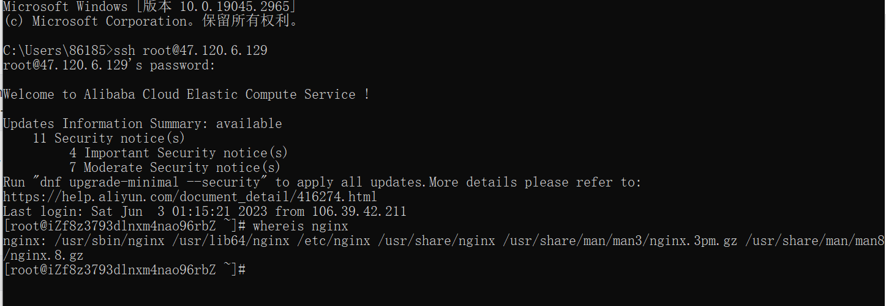
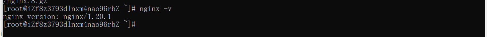
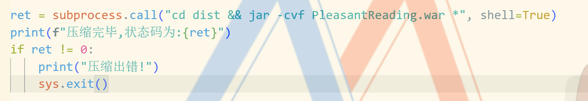
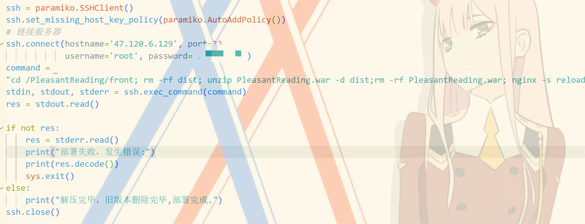
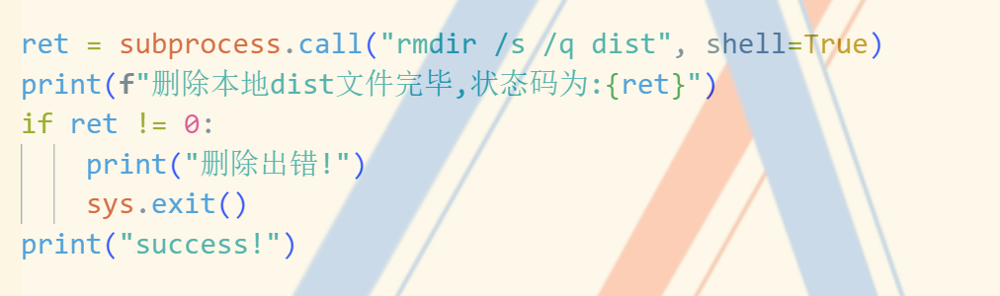

# 怡心阅读部署文档

> 前端部署至：http://47.120.6.129:9000/
>
> 后端部署至：http://154.8.183.51/

## 1.引言 

### 1.1项目背景

随着无纸化阅读趋势的发展，网页阅读已经成为了很多阅读爱好者日常生活中不可或缺的一部分。传统实体书有着笨重、难以携带和价格高的缺点，而网页阅读则具有方便、灵活优势，也能减轻不少学生读书爱好者的经济压力。因此，我们的团队计划开发一款名为“怡心阅读”的在线阅读平台，该平台旨在为用户提供便捷、高效和优质的阅读体验，让读者可以随时在网页上阅读自己喜欢的书籍。我们的平台将提供各种功能，包括分类检索、评论交流、用户记录等，帮助用户轻松找到自己喜欢的书籍、管理自己的读书记录，并建立书籍评论社区供用户交流。

### 1.2编写目的

本文档为怡心阅读的部署文档，本文档的主要目的旨在说明本项目如何在本地部署以及在远程服务器端部署。

### 1.3涉及名词

[1] 管理员：本系统的后台管理者，可以对书籍相关内容进行管理。

[2] 游客：没有注册的网站用户，只能实现部分浏书籍查询书籍功能，注册后可称为普通用户。

[3] 普通用户：已注册的网站用户，具有游客除了注册之外的所有功能，还可以进行书籍收藏、添加书签评论等交互功能。

[4] 会员用户：已注册并开通会员的网站用户，具有普通用户除了注册之外的所有功能，还可以进行阅读特殊仅供会员阅读的会员书籍等功能。

### 1.4项目使用者

本平台的实际使用者为有意愿浏览和使用本网站进行书籍阅读的用户。

系统维护人员为项目开发团队，对于此系统的相关部分比较熟悉，团队内部具有对数据库、计算机、网络较为熟悉的人员。

管理员为开发团队指定的人选，需要有一定的书籍内容审核修改管理经验。

### 1.5参考资料

[1] 吕云翔. 软件工程实用教程[M]. 北京：清华大学出版社, 2015.

[2] Pressman R S. 软件工程: 实践者的研究方法 (英文精编版)[M]. 机械工业出版社, 2008. 

[3] Ian Sommerille. 软件工程(原书第8版)[M]. 机械工业出版社, 2007.

### 1.6相关文档

[1] 《需求规格说明书》

[2] 《软件设计说明书》

[3] 《软件开发计划书》

[4] 《测试报告》

[5] 《用户使用说明书》 

## 2.系统设置

### 2.1硬件运行环境

处理器：Intel® Core™ i7-10750H CPU @2.60GHz

内存：16GB

硬盘容量：1TB

输入输出设备：鼠标、键盘、显示屏

网络设备：宽带

### 2.2软件运行环境

操作系统：Windows 10

连接的后端数据库：MySQL 5.7.30

项目运行环境：Python 3.8

浏览器：Google Chrome

后端开发：Django 4.0.4 

前端开发 ：vue3

## 3.环境搭建和项目运行

### 3.1前端vue环境搭建

#### 3.1.1 下载git

通过链接[Git - Downloading Package (git-scm.com)](https://git-scm.com/download/win)，下载git for windows并进行安装操作

#### 3.1.2 下载Node.js

通过链接[下载 | Node.js (nodejs.org)](https://nodejs.org/zh-cn/download)下载Node.js程序

#### 3.1.3 安装vue环境

在命令行中输入npm install vue -gnpm install vue-router -gnpm install -g @vue/cli 来将vue.js、vue-router、vue-cli 脚手架到 global 全局目录，之后利用语句vue create my-project 完成vue项目的创建。

### 3.2后端开发环境搭建

#### 3.2.1 下载 Tabby

通过链接 [Tabby - a terminal for a more modern age](https://tabby.sh/) 下载到本地电脑中，实现对远程服务器的连接交互

#### 3.2.2 下载 code-server

通过链接下载 [Releases · coder/code-server](https://github.com/coder/code-server/releases)，之后上传到服务器中，使用命令：

```shell
tar -zxvf code-server-4.6.0-linux-amd64.tar.gz # 解压
vim ~/.config/code-server/config.yaml # 编辑配置文件

cd code-server-4.6.0-linux-amd64 # 进入解压好的文件夹内
./code-server # 运行一次code-server
```

修改配置文件为：

```shell
bind-addr: 0.0.0.0:8080
auth: password
password: xxxxxx (密码不做展示)
cert: false
~
```

使用这一步的目的是在服务器中配置类似 `vscode` 的在线编辑代理接口

 #### 3.2.3 安装 miniconda

通过官网链接下载 https://conda.io/en/latest/miniconda.html ，选择 `python` 版本为 `3.8` 并安装各种所需要的库

## 4.项目部署

### 4.1前端部署

#### 4.1.0 服务器环境依赖

Nginx是一款轻量级的Web服务器、反向代理服务器，由于它的内存占用少，启动极快，高并发能力强，在互联网项目中广泛应用，我们的网站部署到Nginx服务器上。当然也可以选择其它web服务器，这里我们就使用主流的Nginx。

##### 先查看服务器是否有nginx

命令如下：

```text
whereis nginx
```

如果出现如下界面，则已安装nginx，可跳过本节。



##### 安装nginx

命令如下：

```text
yum install -y nginx 	// 服务器配置有yum
或 sudo apt-get install nginx // 服务器配置有apt-get
```

如果未配置yum源的，可参考网上如何使用yum安装nginx。

##### 查看nginx安装目录

命令如下：

```text
whereis nginx
```

或者使用命令查看nginx版本号，出现版本号也代表安装成功。

```
nginx -V
```



##### 更改nginx配置

通过上述命令`whereis nginx`获取nginx安装目录，通常linux系统下为`/etc/ngnix`

在nginx.conf文件下更改如下配置

```shell
server {
        listen       9000;	# 服务器暴露端口，可自行定义
        listen       [::]:80;
        server_name  _;		# 服务器解析域名
        root         /PleasantReading/front/dist;  # 代码文件目录。可自行定义，如果更改则自动打包文件对应上传目录也需更改

        # Load configuration files for the default server block.
        # include /etc/nginx/default.d/*.conf;
		
		# 由于项目是单网页项目,需要加入如下配置，使得切换路由时网页会定位到index
        location / {
           try_files $uri $uri/ @router;
           index  index.html index.htm;
        }
        location @router {
                rewrite ^.*$ /index.html last;
        }
        # 到此处为止
        
        error_page 404 /404.html;
            location = /40x.html {
        }

        error_page 500 502 503 504 /50x.html;
            location = /50x.html {
        }
    }
```

#### 4.1.1前端vue项目本地部署

node.js环境下输入如下代码即可在本地部署

```shell
npm install && npm run serve
```

#### 4.1.2前端vue项目打包自动上传(向服务器部署)

本项目采用python构建自动部署可执行程序，其步骤如下：

1.将vue项目打包并将dist文件压缩,打包过程代码如图所示：




2.将压缩包传输到服务器指定目录下。其过程代码如图所示：


3.建立ssh链接执行替换操作。替换文件并重启nginx如图所示：



4.删除本地文件。删除本地文件代码如图所示：



5.构建python程序

在命令行使用语句`pyinstaller -F deploy.py`构建可执行程序，生成后双击即可完成部署(pyinstaller 同样为外部库需要自行使用pip安装并配置环境变量)

#### 4.1.3 CD 流水线设计及实现（通过Github Action）(远程部署)

在仓库中添加workflow，其中main.yaml文件如下：

```yaml
name: Build front and deploy to Server(front CD)
on:
  #监听push操作
  push:
    branches:
      # front分支，你也可以改成其他分支
      - front
jobs:
  # 任务ID
  build:
    # 运行环境
    runs-on: ubuntu-latest
    # 步骤
    steps:
    # 使用别人的action
    - uses: actions/checkout@v3
    # 步骤名称
    - name: npm install
      # 步骤执行指令
      run: npm install
    - name: npm run build
      run: npm run build
    # 命名这个任务为发布Deploy
    - name: Deploy
      # 因为构建之后，需要把代码上传到服务器上，所以需要连接到ssh，并且做一个拷贝操作
      uses: cross-the-world/scp-pipeline@master
      env:
        WELCOME: "ssh scp ssh pipelines"
        LASTSSH: "Doing something after copying"
      with:
        host: ${{ secrets.USER_HOST }}	# host user password全部写在secrets里不明文给出
        user: ${{ secrets.USER_NAME }} 	
        pass: ${{ secrets.USER_PASS }}	
        connect_timeout: 10s
        local: './dist/*'
        remote: /PleasantReading/front/dist
```

当仓库push代码即可实现自动部署至远程服务器上

### 4.2后端部署

后端使用 `uwsgi` 和 `nginx` 配合部署。

#### 4.2.1 `uwsgi` 配置

首先下载安装：

```shell
sudo apt-get install python3-dev
sudo apt-get install python3-pip
sudo pip3 install uwsgi
```

之后在项目的根目录下添加 `uwsgi.ini` 文件：

```shell
[uwsgi]
socket = 127.0.0.1:5000
chdir = /home/ubuntu/PleasantReading_SE_2023/BUAA-SE-2023-PleasantReading/PleasantReading
wsgi-file = PleasantReading/wsgi.py
uwsgi_pythonpath = /home/ubuntu/miniconda3/envs/web/lib/python3.8/site-packages
master = true
enable-threads = true
processes = 6
buffer-size = 65536
vacuum = true
daemonize = uwsgi.log
pidfile=uwsgi.pid
uwsgi_read_timeout = 800
threads = 4
chmod-socket = 664
```

#### 4.2.2 nginx 配置

基础配置与前端类似，在此不做配置文件相关展开描述。

除此之外，需要在 `/etc/nginx/conf.d/` 下新建文件 `default.conf` 有：

```shell
server {
        listen 80;
        # listen 443 ssl;
        server_name 154.8.183.51 www.abyss7893.com;
        location / {
                include /etc/nginx/uwsgi_params;
                uwsgi_pass 127.0.0.1:5000;  # 需要与前面 uwsgi.ini 一致
        }
        # 如果没有ssl证书，下面的ssl_*的语句不需要装上去
        # ssl_certificate /etc/nginx/echo17666.com_bundle.crt;
        # ssl_certificate_key /etc/nginx/echo17666.com.key;
        # ssl_session_timeout 5m;
        # ssl_protocols TLSv1.2 TLSv1.3;
        # ssl_ciphers ECDHE-RSA-AES128-GCM^BSHA256:ECDHE:ECDH:AES:HIGH:!NULL:!aNULL:!MD5:!ADH:!RC4:!DH:!DHE;
        # ssl_prefer_server_ciphers on;
        # error_page 497 https://$host$uri?$args;
}
```

此时启动 `nginx` 即部署成功。

另外为实现部署便捷化，在此给出配置的部署脚本文件：

```shell
#!/bin/bash

killall -9 uwsgi
rm uwsgi.log
uwsgi --ini uwsgi.ini

ps -ef | grep uwsgi

sudo service nginx reload
sudo service nginx start
echo "successful"
```


